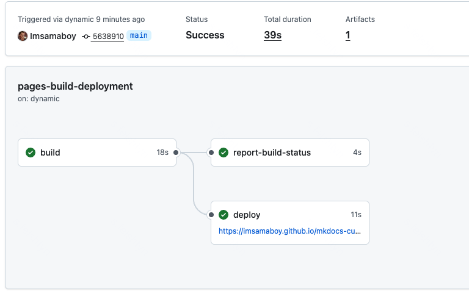
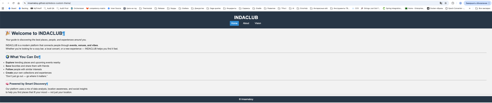

## Кастомизация статического сайта (шаблонизация, сборка статики: HTML, CSS, JS)

### Шаги работы

1. Создать собственную тему на основе HTML, CSS, JS с использованием или без использования CSS-библиотек таких как Bootstrap, Bulma, фреймворков (например, Tailwind), JS-библиотек для разработки фронтэнда (например, React). 
2. Разработать пайплайн или набор пайплайнов (yml-файл) для тестирования и  сборки статики (HTML, CSS, JS) — фронтэнда сайта, а затем построения собственно самого сайта (интеграции контента в разметке Markdown в шаблон сайта) и деплоя его на GitHub Pages. 
3. Необходимо учесть, что HTML файлы должны валидироваться на корректность, минифицироваться, должна быть предусмотрена сборка с помощью PostCSS.

### Описание выполнения работы

1. Создание папки `theme` с файлами шаблона `main.html` и стилей `styles.css`.

https://github.com/Imsamaboy/mkdocs-custom-theme/tree/main/indaclub/theme

2. Успешное выполнение команд из пайплайна

 

3. Сайт с кастомной темой, автоматически опубликованный на `gh-pages`

